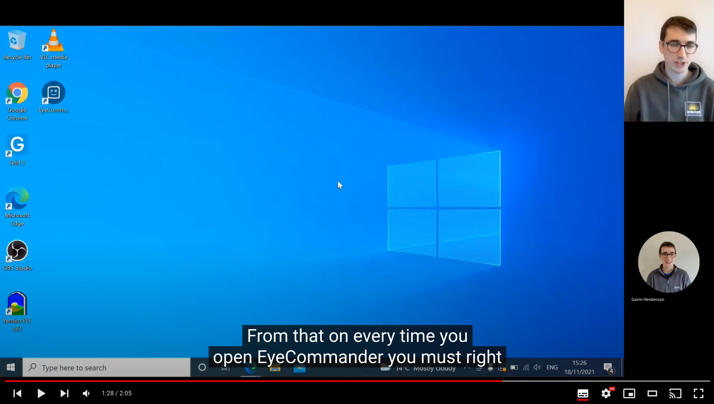

  

<i>Detect eye gestures and convert them to switch outputs</i>

  
  
  
  
  
  
  

  

## Table of contents

- [Table of contents](#table-of-contents)
- [Installing](#installing)
- [Documentation](#documentation)
- [How to use](#how-to-use)
- [Getting involved](#getting-involved)
  - [What should I work on](#what-should-i-work-on)
  - [Local Development](#local-development)
  - [Publishing a new version](#publishing-a-new-version)
  - [Sponsorship](#sponsorship)
- [Thanks to](#thanks-to)
- [Licence](#licence)

## Installing

EyeCommander includes an installer that will automatically add EyeCommander to your system. Every version of EyeCommander is published as a release on Github. You can see the [releases on Github here](https://github.com/AceCentre/EyeCommander/releases). The release at the top is the most recent.

If you are Windows then you should download the file named `EyeCommander-x.x.x.Setup.exe`. If you are on OSx then you should use the file `EyeCommander.dmg`. Once you have downloaded these files then you should open them and they will install EyeCommander for you.

Once you have EyeCommander installed you will be prompted to install an update automatically everytime one is available.

## Documentation

All developer documentation is available here on Github.

[All user facing documentation is available on our docs website](https://docs.acecentre.org.uk/eyecommander/)

The user facing documentation is synced to this repo via Gitbooks. You can see the raw documentation in the `/docs` folder

## How to use

Check out our help video series on youtube.

## Getting involved

### What should I work on

Thank you for considering contributing to the project.

We would love to help you contribute to the project. You can see what we are currently working on and what we plan to work on in our [roadmap here](https://github.com/AceCentre/EyeCommander/projects/1). The items in the `todo` column are roughly in order of priority, however feel free to pick up anything that interests you.

Once you have picked an issue that you want to work on then drop a comment on the issue and tag either @WillWade or @GavinHenderson and we can help you contribute and give you pointers.

### Local Development

To develop EyeCommander locally follow these steps:

1. Install dependancies with `yarn install`.
2. Run the electron app in development mode with `yarn start`.
3. Changes to renderer code will automatically reload
4. To use changes to the backend you will have to rerun `yarn start`

### Publishing a new version

1. Change the `version` in the `package.json` file.
2. Commit that change.
3. Done

This will then automatically publish a new version to github which will then be picked up by existing clients who will pull the latest version!

### Sponsorship

Thank you for considering sponsoring this project. Contact either Will Wade (wwade@acecentre.org.uk) or Gavin Henderson (ghenderson@acecentre.org.uk) to learn more about sponsorhip oppertunities.

## Thanks to

This is a project started by Lucas Henrique, Daniel Kashkett, and Giovanbattista Amato for AceCentre as part of the 2021 Chronic Coders Coding Academy. The EyeCommander is designed as an open-source solution to eye-gesture detection that will work without the need for a fancy camera or expensive software.

## Licence

The software is distributed under the [MIT](LICENSE) licence.

Content used under CC:

- Emoticon by Astatine Lab from the Noun Project
